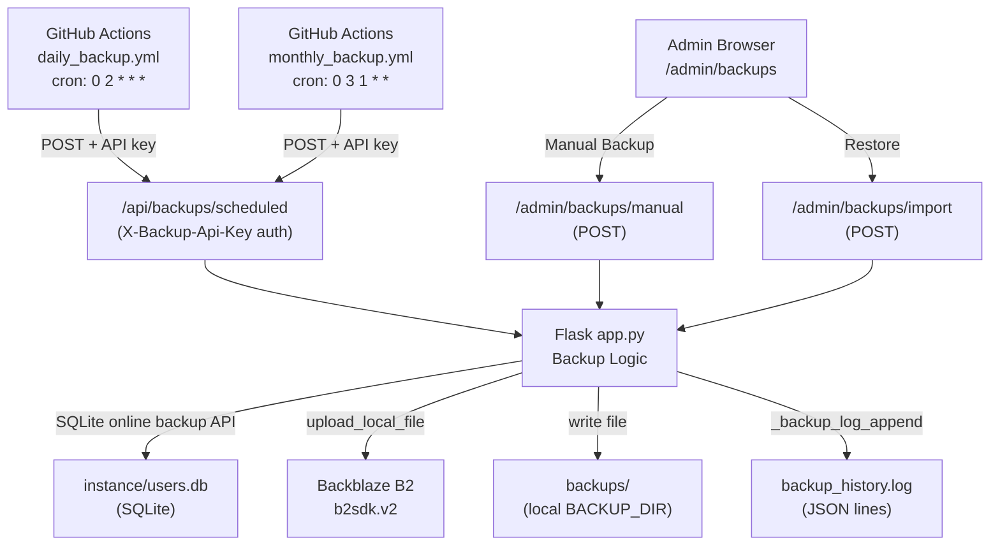

# Design Document: Backup Management Overhaul

## Overview

This design covers a comprehensive overhaul of the Backup Management system in Surveyor.AI. The system is a Flask/SQLite application where backups are currently broken or incomplete in several ways: the B2 connection status is unreliable, there are no automated recurring backups, the manual backup doesn't upload to B2, the restore flow lacks proper audit logging, and the UI layout is suboptimal.

The overhaul introduces:
- A live B2 auth check on settings page load
- GitHub Actions-driven daily incremental and monthly full backups via a new authenticated `/api/backups/scheduled` endpoint
- A manual backup route that saves locally and uploads to B2
- A proper restore flow with pre-restore preservation and audit logging
- A redesigned history table with type columns, filter buttons, and a "No New Data" badge
- A side-by-side Export/Restore UI layout
- `created_at` columns on `User` and `AuditLog` models with safe startup migrations

The Flask app runs on Render (or similar). GitHub Actions runs on a cron schedule and POSTs to the live app URL. The app never needs to be "online" for GitHub Actions to trigger — but the endpoint must be reachable when the cron fires.

---

## Architecture



Key design decisions:
- The `/api/backups/scheduled` endpoint is **not** protected by `_require_admin()` (no session cookie from GitHub Actions). Instead it uses a static `X-Backup-Api-Key` header validated against the `backup_api_key` Settings row.
- The endpoint is exempt from `_block_writes_during_restore` middleware so GitHub Actions health checks always get a response.
- `BACKUP_LOCK` (existing `threading.Lock`) guards all backup operations to prevent concurrent runs.
- Incremental backup uses a temporary SQLite file built by copying only the rows newer than `last_daily_backup_ts` from each tracked table.
- The `BACKUP_API_KEY` is seeded from the `BACKUP_API_KEY` env var on first startup, or auto-generated as a 32-byte hex token if absent.

---

## Components and Interfaces

### 1. Startup Migration (`_run_startup_migrations`)

Called once inside `with app.app_context()` at startup. Runs two safe `ALTER TABLE ... ADD COLUMN` statements guarded by a try/except (SQLite raises `OperationalError` if the column already exists).

```python
def _run_startup_migrations():
    with db.engine.connect() as conn:
        # User.created_at
        try:
            conn.execute(text("ALTER TABLE user ADD COLUMN created_at INTEGER"))
            conn.execute(text("UPDATE user SET created_at = 0 WHERE created_at IS NULL"))
            conn.commit()
        except Exception:
            pass  # column already exists
        # AuditLog.created_at
        try:
            conn.execute(text("ALTER TABLE audit_log ADD COLUMN created_at INTEGER"))
            conn.execute(text("UPDATE audit_log SET created_at = timestamp WHERE created_at IS NULL"))
            conn.commit()
        except Exception:
            pass
```

### 2. API Key Seeding (`_seed_backup_api_key`)

Called at startup. Reads `BACKUP_API_KEY` env var; if absent, generates `secrets.token_hex(32)`. Upserts into `Settings` table under key `backup_api_key` only if not already present.

### 3. `/api/backups/scheduled` Endpoint

- Method: `POST`
- Auth: `X-Backup-Api-Key` header matched against `Settings.query.filter_by(key='backup_api_key').first().value`
- Body: `{"type": "daily" | "monthly"}`
- Returns: JSON `{"success": bool, "message": str}` with appropriate HTTP status
- Exempt from `_block_writes_during_restore`
- Acquires `BACKUP_LOCK` (non-blocking); returns 409 if already locked

**Daily flow:**
1. Read `last_daily_backup_ts` from Settings (default 0)
2. Query all 7 tables for rows where `created_at > last_daily_backup_ts`
3. If no rows found → log `{backup_type: "daily", status: "success", note: "no_new_data"}` → return 200
4. Build incremental SQLite: create temp `.db`, create schema, insert matching rows
5. Upload to B2 as `incremental_YYYYMMDD_HHMMSS.db`
6. Update `last_daily_backup_ts` in Settings
7. Log `{backup_type: "daily", status: "success", filename: "..."}`

**Monthly flow:**
1. Full SQLite online backup to temp file
2. Upload to B2 as `full_YYYYMMDD_HHMMSS.db`
3. Update `last_monthly_backup_ts` in Settings
4. Log `{backup_type: "monthly", status: "success", filename: "..."}`

### 4. `/admin/backups/manual` Endpoint

- Method: `POST`
- Auth: `_require_admin()` + CSRF
- Acquires `BACKUP_LOCK` (non-blocking); returns 409 if locked
- Checks B2 credentials exist; returns 400 if not configured
- Full SQLite online backup → `manual_YYYYMMDD_HHMMSS.db`
- Saves to `BACKUP_DIR` locally
- Uploads to B2
- Logs `{backup_type: "manual", operation: "export", status: "success/failure", filename: "..."}`
- Returns JSON

### 5. Updated `/admin/backups/import` (Restore)

Existing route updated to:
- Preserve pre-restore DB as `instance/users.db.before_restore_<ts>` before overwriting
- Log with `backup_type="restore"` in `_backup_log_append`
- Call `write_audit_log('BACKUP_RESTORED', ...)` with filename and actor user ID

### 6. Updated `settings_page` B2 Check

The existing `settings_page` already performs a live B2 auth check. The fix is to ensure the `b2_connected` flag is set correctly and that any exception (including `BucketNotFound`, network errors) is caught and results in `b2_connected = False` without re-raising.

### 7. GitHub Actions Workflows

**`.github/workflows/daily_backup.yml`**
- Triggers: `schedule` (cron `0 2 * * *`), `workflow_dispatch`
- Steps: single `curl` step posting to `${{ secrets.APP_BASE_URL }}/api/backups/scheduled` with `X-Backup-Api-Key: ${{ secrets.BACKUP_API_KEY }}` and body `{"type":"daily"}`
- Uses `--fail` flag so curl exits non-zero on non-2xx → workflow fails visibly

**`.github/workflows/monthly_backup.yml`**
- Same structure, cron `0 3 1 * *`, body `{"type":"monthly"}`

### 8. History Table Rendering

`admin_backups_page` already reads `_backup_log_read(50)`. Updates:
- Add `backup_type` derivation: if `backup_type` key missing, derive from `operation` (`"export"` → `"manual"`, `"import"` → `"restore"`)
- Pass `backup_type` to template for each history item

### 9. UI Changes

**`backup_management.html`:**
- Wrap Export + Restore sections in a `<div class="backup-panels">` flex container
- Add "Manual Backup" button inside Export section (AJAX POST to `/admin/backups/manual`)
- Add filter buttons row above history table
- Add `Type` column to history table
- Add "No New Data" badge logic in Status column
- History table wrapped in `<div class="history-container">` (already has `max-height: 400px; overflow-y: auto`)

**`backups.css`:**
- `.backup-panels`: `display: flex; gap: 24px;` with each child `.backup-section` at `flex: 1 1 50%`
- `@media (max-width: 768px)`: `.backup-panels { flex-direction: column; }`
- `.type-badge`: pill badge for Daily/Monthly/Manual/Restore
- `.badge-no-new-data`: distinct style for "No New Data" status
- `.filter-btn`, `.filter-btn.active`: filter button styles

---

## Data Models

### Updated `User` Model

```python
class User(db.Model):
    # ... existing columns ...
    created_at = db.Column(db.Integer, nullable=False, default=lambda: int(time.time()))
```

### Updated `AuditLog` Model

```python
class AuditLog(db.Model):
    # ... existing columns (timestamp, actor_id, etc.) ...
    created_at = db.Column(db.Integer, nullable=False, default=lambda: int(time.time()))
```

`created_at` is a dedicated insertion timestamp. The existing `timestamp` column records when the audited action occurred (they may differ if audit log writes are deferred).

### Settings Keys (new)

| Key | Type | Description |
|-----|------|-------------|
| `backup_api_key` | String (hex) | Token for authenticating `/api/backups/scheduled` |
| `last_daily_backup_ts` | Integer (unix ts) | Timestamp of last successful daily backup |
| `last_monthly_backup_ts` | Integer (unix ts) | Timestamp of last successful monthly backup |

### Backup Log Entry Schema

Each JSON line in `backup_history.log`:

```json
{
  "user": "admin_username_or_system",
  "operation": "export | import",
  "backup_type": "daily | monthly | manual | restore",
  "filename": "incremental_20260101_020000.db | null",
  "timestamp": 1751234567,
  "status": "success | failure",
  "note": "no_new_data | null",
  "error": "error message | null"
}
```

Legacy entries without `backup_type` are handled by the template/view layer: `operation == "export"` → display as `"Manual"`, `operation == "import"` → display as `"Restore"`.

### Incremental Backup Structure

The incremental `.db` file is a valid SQLite database containing only the rows newer than `last_daily_backup_ts` from these tables: `report`, `detection`, `reaction`, `report_flag`, `notification`, `user`, `audit_log`. The schema (CREATE TABLE statements) is copied from the source DB so the file is self-contained and restorable.

---

## Correctness Properties


*A property is a characteristic or behavior that should hold true across all valid executions of a system — essentially, a formal statement about what the system should do. Properties serve as the bridge between human-readable specifications and machine-verifiable correctness guarantees.*

### Property 1: API Key Auth Rejection

*For any* POST request to `/api/backups/scheduled` with a missing or incorrect `X-Backup-Api-Key` header, the system should return HTTP 401 and the backup log should not gain a new entry.

**Validates: Requirements 2.8, 9.1**

---

### Property 2: Incremental Backup Row Filtering

*For any* value of `last_daily_backup_ts` and any set of rows in the tracked tables, the daily incremental backup should contain exactly the rows where `created_at > last_daily_backup_ts` — no more, no fewer.

**Validates: Requirements 2.3, 11.7**

---

### Property 3: Scheduled Backup Always Logs with Correct Type

*For any* valid scheduled backup request (daily or monthly), regardless of success or failure, the backup log should gain exactly one new entry with `backup_type` matching the requested type (`"daily"` or `"monthly"`).

**Validates: Requirements 2.5, 3.5**

---

### Property 4: Successful Scheduled Backup Updates Filename and Timestamp

*For any* successful scheduled backup run, the log entry's `filename` should match the expected pattern (`incremental_YYYYMMDD_HHMMSS.db` for daily, `full_YYYYMMDD_HHMMSS.db` for monthly), and the corresponding `last_daily_backup_ts` or `last_monthly_backup_ts` Settings key should be updated to a value greater than its previous value.

**Validates: Requirements 2.4, 3.4**

---

### Property 5: Monthly Backup Produces Valid Full SQLite Copy

*For any* monthly backup request, the resulting backup file should be a valid SQLite database (passes `PRAGMA integrity_check`) containing all tables present in the source `instance/users.db`.

**Validates: Requirements 3.3**

---

### Property 6: Manual Backup Saves to Both BACKUP_DIR and B2

*For any* successful manual backup request, a file matching the pattern `manual_YYYYMMDD_HHMMSS.db` should exist in `BACKUP_DIR` and the B2 upload function should have been called with that filename.

**Validates: Requirements 4.1**

---

### Property 7: Manual Backup Always Logs

*For any* manual backup request (success or failure), the backup log should gain exactly one new entry with `backup_type` set to `"manual"` and `operation` set to `"export"`.

**Validates: Requirements 4.2, 4.3**

---

### Property 8: Concurrent Backup Lock Returns 409

*For any* backup request (scheduled, manual, or restore) that arrives while `BACKUP_LOCK` is already held, the system should return HTTP 409 and no new backup operation should begin.

**Validates: Requirements 4.5**

---

### Property 9: Restore Validation Gates Overwrite

*For any* uploaded file that fails `_validate_backup_db` (not a valid SQLite file or missing required tables), the restore operation should return an error response and `instance/users.db` should remain unchanged.

**Validates: Requirements 5.1, 5.4**

---

### Property 10: Restore Always Logs with backup_type "restore"

*For any* restore operation (success or failure), the backup log should gain exactly one new entry with `backup_type` set to `"restore"` and `operation` set to `"import"`.

**Validates: Requirements 5.2**

---

### Property 11: Restore Always Writes Audit Log Entry

*For any* successful restore operation, the `AuditLog` table should gain a new entry with `action` set to `"BACKUP_RESTORED"` containing the restored filename in the `detail` field.

**Validates: Requirements 5.3**

---

### Property 12: Pre-Restore DB is Preserved Before Overwrite

*For any* restore operation, before `instance/users.db` is overwritten, the original file should be copied to `instance/users.db.before_restore_<timestamp>` and that file should exist after the operation completes (whether the restore succeeds or fails).

**Validates: Requirements 5.5**

---

### Property 13: Type Label Derivation is Correct

*For any* backup log entry, the displayed type label should be: the capitalized `backup_type` value if the field is present, or `"Manual"` if `operation == "export"` and `backup_type` is absent, or `"Restore"` if `operation == "import"` and `backup_type` is absent.

**Validates: Requirements 6.2, 6.3**

---

### Property 14: No New Data Badge Rendering

*For any* backup log entry where `status == "success"` and `note == "no_new_data"`, the rendered history row should contain the "No New Data" badge element and should not contain the standard "Success" badge.

**Validates: Requirements 6.7**

---

### Property 15: Download Route Serves File as Attachment

*For any* filename that exists in `BACKUP_DIR`, a GET request to `/admin/backups/download/<filename>` should return HTTP 200 with `Content-Disposition: attachment`.

**Validates: Requirements 7.1**

---

### Property 16: Download Button Only Shown When can_download is True

*For any* history entry rendered in the table, the Download button/link should appear in the Actions column if and only if `can_download` is `True` for that entry.

**Validates: Requirements 7.2**

---

### Property 17: secure_filename Sanitizes Path Traversal

*For any* filename containing path traversal sequences (e.g., `../`, `../../etc/passwd`), `secure_filename()` applied before constructing the file path should produce a filename with no directory separators, preventing access outside `BACKUP_DIR`.

**Validates: Requirements 7.4**

---

### Property 18: API Key Seeding

*For any* app startup where `BACKUP_API_KEY` env var is set, the `backup_api_key` Settings row should contain exactly that value. For any startup where the env var is absent and no `backup_api_key` row exists, the stored value should be a 64-character lowercase hex string.

**Validates: Requirements 9.2**

---

### Property 19: Startup Migrations are Idempotent with Correct Backfill

*For any* number of app restarts, the `user` table should always have a `created_at` column (existing rows backfilled with `0`), and the `audit_log` table should always have a `created_at` column (existing rows backfilled from their `timestamp` column). Running the migration multiple times should not raise an error.

**Validates: Requirements 11.3, 11.4**

---

### Property 20: New Model Instances Get Current Unix Timestamp for created_at

*For any* newly created `User` or `AuditLog` record, the `created_at` value should be within a small delta (e.g., ±5 seconds) of `int(time.time())` at the moment of creation.

**Validates: Requirements 11.5, 11.6**

---

### Property 21: B2 Credentials Stored on Connect

*For any* successful call to `/settings/b2/connect` with valid `key_id`, `app_key`, and `bucket_name`, the Settings table should contain rows for all three keys (`b2_key_id`, `b2_app_key`, `b2_bucket_name`) with the submitted values.

**Validates: Requirements 1.1**

---

### Property 22: B2 Disconnect Removes All Credential Keys

*For any* state where B2 credentials exist in the Settings table, calling `/settings/b2/disconnect` should result in the Settings table containing no rows with keys `b2_key_id`, `b2_app_key`, or `b2_bucket_name`.

**Validates: Requirements 1.4**

---

## Error Handling

### B2 Errors
- All B2 SDK calls are wrapped in `try/except Exception`. On failure, `b2_connected = False` is set and the error is swallowed (logged to app logger at DEBUG level). No unhandled exceptions propagate to the user.
- If B2 credentials are missing when a backup is triggered, the endpoint returns HTTP 503 (scheduled) or HTTP 400 (manual) with a JSON error body.

### Backup Lock Contention
- `BACKUP_LOCK.acquire(blocking=False)` is used everywhere. If the lock is held, HTTP 409 is returned immediately with `{"success": false, "message": "A backup operation is already in progress."}`.

### Restore Safety
- Before overwriting `instance/users.db`, the current file is copied to `instance/users.db.before_restore_<ts>` using `shutil.copy2`. This happens before `db.session.remove()` and `db.engine.dispose()`.
- If the copy fails, the restore is aborted and an error is returned.
- `RESTORE_STATE["in_progress"]` is set to `True` during restore and reset in a `finally` block.

### Incremental Backup with No Data
- If all 7 table queries return 0 rows, the backup logs `note: "no_new_data"` and returns HTTP 200 without uploading to B2. `last_daily_backup_ts` is still updated so the next run doesn't re-scan old data.

### Migration Failures
- `ALTER TABLE` statements are wrapped in individual `try/except` blocks. `OperationalError: duplicate column name` is silently ignored. Any other exception is logged but does not prevent app startup.

### API Key Auth
- Missing or wrong `X-Backup-Api-Key` → HTTP 401, no backup performed, no log entry written.
- Missing `type` field or invalid type value → HTTP 400.

---

## Testing Strategy

### Dual Testing Approach

Both unit tests and property-based tests are required. Unit tests cover specific examples, integration points, and edge cases. Property-based tests verify universal correctness across many generated inputs.

### Property-Based Testing

**Library:** `hypothesis` (Python) — already present in the project (`.hypothesis/` directory exists).

**Configuration:** Each property test runs a minimum of 100 examples (`@settings(max_examples=100)`).

**Tag format:** Each test is tagged with a comment:
```
# Feature: backup-management-overhaul, Property N: <property_text>
```

Each correctness property maps to exactly one `@given`-decorated test function.

**Example property test structure:**

```python
from hypothesis import given, settings, strategies as st

# Feature: backup-management-overhaul, Property 2: Incremental backup row filtering
@given(
    last_ts=st.integers(min_value=0, max_value=2_000_000_000),
    rows=st.lists(st.fixed_dictionaries({'created_at': st.integers(min_value=0, max_value=2_000_000_000)}))
)
@settings(max_examples=100)
def test_incremental_backup_row_filtering(last_ts, rows):
    included = [r for r in rows if r['created_at'] > last_ts]
    result = _filter_rows_for_incremental(rows, last_ts)
    assert result == included
```

### Unit Tests

Unit tests focus on:
- Specific examples: valid B2 connect/disconnect, known filename patterns, known log entries
- Integration points: `_backup_log_append` → `_backup_log_read` round-trip
- Edge cases: empty backup file, missing `backup_type` in legacy log entries, path traversal filenames, missing B2 credentials
- Error conditions: invalid SQLite file upload, missing required tables in restore file

**Avoid over-testing:** Property tests handle broad input coverage. Unit tests should not duplicate what property tests already cover.

### Test File Organization

```
tests/
  test_backup_properties.py   # All property-based tests (one per correctness property)
  test_backup_unit.py         # Unit tests for specific examples and edge cases
  test_migrations.py          # Idempotency tests for startup migrations
```

### Key Test Scenarios

| Scenario | Test Type |
|----------|-----------|
| Incremental backup filters rows by created_at | Property (P2) |
| API key rejection for all invalid keys | Property (P1) |
| Scheduled backup always logs | Property (P3) |
| Restore validation blocks invalid files | Property (P9) |
| secure_filename strips path traversal | Property (P17) |
| Migration runs twice without error | Property (P19) |
| Manual backup with B2 not configured | Unit (edge case) |
| Legacy log entry type derivation | Unit (example) |
| No New Data badge in rendered HTML | Unit (example) |
| Download route returns 404 for missing file | Unit (edge case) |
