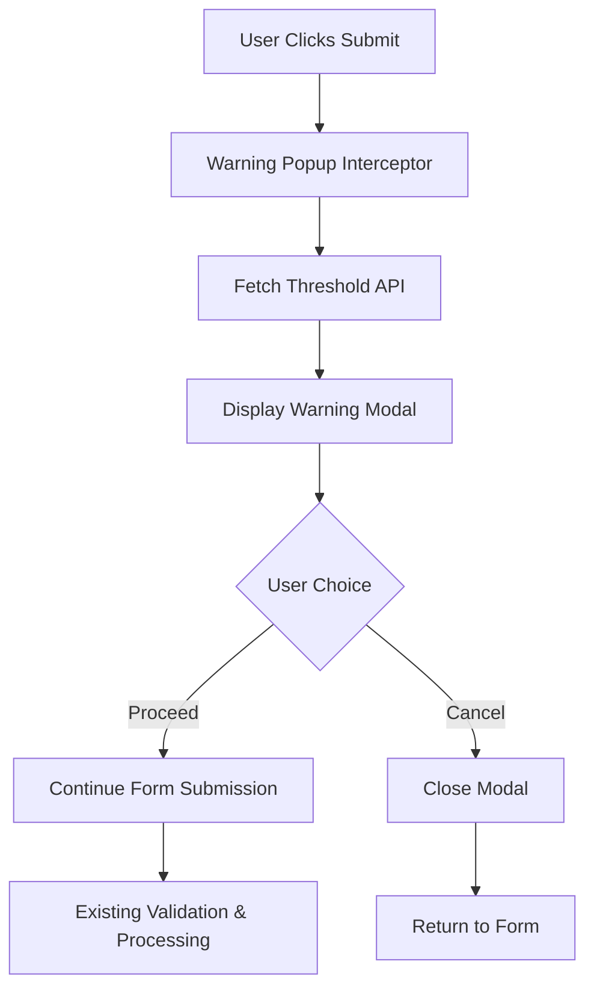

# Design Document: False Report Warning Popup

## Overview

The false report warning popup is a modal dialog that appears before users submit reports, informing them about the consequences of submitting false reports. This feature integrates seamlessly with the existing report submission flow by intercepting form submission and displaying a warning that includes the current false report threshold dynamically fetched from the settings system.

The design follows the existing application's modal patterns (as seen in the logout modal) and maintains consistency with the established UI/UX design language. The popup serves as both a deterrent for false reports and an educational tool to ensure users understand the consequences of their actions.

## Architecture

### System Integration Points

The warning popup integrates with several existing system components:

1. **Report Submission Flow**: Intercepts the existing form submission in `/reports`
2. **Settings System**: Fetches `false_report_threshold` from the Settings table
3. **Modal System**: Reuses existing modal styling and behavior patterns
4. **Form Validation**: Maintains existing client-side and server-side validation

### Component Architecture



### Data Flow

1. User fills out report form and clicks submit
2. JavaScript intercepts the submit event
3. AJAX call fetches current `false_report_threshold` from `/api/threshold`
4. Warning modal displays with dynamic threshold value
5. User chooses to proceed or cancel
6. If proceeding, form submission continues normally
7. If canceling, modal closes and form remains unchanged

## Components and Interfaces

### Frontend Components

#### Warning Modal Component
- **File**: `templates/false_report_warning_modal.html`
- **Purpose**: Reusable modal template following existing modal patterns
- **Dependencies**: Existing modal CSS classes and JavaScript patterns

#### Form Interceptor
- **Location**: Inline JavaScript in `templates/reports.html`
- **Purpose**: Intercepts form submission and triggers warning flow
- **Integration**: Extends existing form validation logic

### Backend Components

#### Threshold API Endpoint
- **Route**: `/api/false-report-threshold`
- **Method**: GET
- **Purpose**: Returns current false report threshold value
- **Response Format**: `{"threshold": 5}`

#### Settings Integration
- **Component**: Existing Settings model and service
- **Key**: `false_report_threshold`
- **Default Value**: 5 (as specified in requirements)

## Data Models

### Settings Model (Existing)
The existing Settings model already handles the `false_report_threshold` configuration:

```python
class Settings(db.Model):
    id = db.Column(db.Integer, primary_key=True)
    key = db.Column(db.String(100), unique=True, nullable=False)
    value = db.Column(db.Text, nullable=False)
```

### API Response Model
```json
{
  "threshold": 5,
  "success": true
}
```

## Correctness Properties

*A property is a characteristic or behavior that should hold true across all valid executions of a system-essentially, a formal statement about what the system should do. Properties serve as the bridge between human-readable specifications and machine-verifiable correctness guarantees.*

### Property 1: Warning popup appears before form submission
*For any* report form submission attempt, the warning popup should appear and prevent the form from being submitted until the user makes a choice.
**Validates: Requirements 1.1, 6.1, 6.2**

### Property 2: Dynamic threshold display
*For any* threshold value set in the settings, the warning popup should display that exact value in the warning message.
**Validates: Requirements 1.2, 2.2, 5.3**

### Property 3: Threshold API integration
*For any* popup display event, the system should fetch the current false_report_threshold from the Settings service via API call.
**Validates: Requirements 2.1**

### Property 4: Threshold updates without restart
*For any* change to the false_report_threshold setting, the warning popup should display the new value immediately without requiring application restart.
**Validates: Requirements 2.4**

### Property 5: Button functionality
*For any* user interaction with the proceed or cancel buttons, the system should close the popup and either continue or prevent form submission accordingly.
**Validates: Requirements 3.3, 3.4**

### Property 6: Overlay click behavior
*For any* click outside the popup modal, the system should treat it as a cancel action and close the popup without submitting the form.
**Validates: Requirements 3.5**

### Property 7: Mobile responsiveness
*For any* screen size or device type, the warning popup should display correctly and remain functional on mobile devices.
**Validates: Requirements 4.4**

### Property 8: Accessibility compliance
*For any* user interaction method (keyboard, screen reader, etc.), the warning popup should follow accessibility best practices for modal dialogs.
**Validates: Requirements 4.5**

### Property 9: Form validation preservation
*For any* existing form validation rule, the warning system should not interfere with client-side validation logic and should maintain all existing error handling.
**Validates: Requirements 6.3, 6.4, 6.5**

## Error Handling

### API Error Scenarios

#### Threshold Fetch Failure
- **Scenario**: API call to `/api/false-report-threshold` fails
- **Handling**: Use default value of 5 and log error
- **User Experience**: Warning popup still appears with default threshold
- **Implementation**: JavaScript try-catch with fallback value

#### Network Timeout
- **Scenario**: API request times out
- **Handling**: 3-second timeout with fallback to default
- **User Experience**: Minimal delay before popup appears with default value
- **Implementation**: `fetch()` with timeout and Promise.race()

#### Invalid Response Format
- **Scenario**: API returns malformed JSON or unexpected structure
- **Handling**: Parse error triggers default value usage
- **User Experience**: Popup appears normally with default threshold
- **Implementation**: JSON parsing with error handling

### UI Error Scenarios

#### Modal Display Failure
- **Scenario**: Modal HTML elements are missing or corrupted
- **Handling**: Graceful degradation to browser confirm dialog
- **User Experience**: Basic confirmation still appears
- **Implementation**: Fallback to `window.confirm()` if modal fails

#### JavaScript Disabled
- **Scenario**: User has JavaScript disabled in browser
- **Handling**: Form submits normally without warning
- **User Experience**: No warning popup, but form still functions
- **Implementation**: Progressive enhancement approach

### Settings Error Scenarios

#### Missing Threshold Setting
- **Scenario**: `false_report_threshold` setting not found in database
- **Handling**: API returns default value of 5
- **User Experience**: Warning appears with default threshold
- **Implementation**: Database query with null check and default

#### Invalid Threshold Value
- **Scenario**: Threshold setting contains non-numeric value
- **Handling**: Parse error triggers default value
- **User Experience**: Warning appears with default threshold
- **Implementation**: `parseInt()` with error handling

## Testing Strategy

### Unit Testing Approach

The testing strategy employs both unit tests for specific scenarios and property-based tests for comprehensive coverage:

**Unit Tests Focus Areas:**
- API endpoint responses for various threshold values
- Modal display and hide functionality
- Button click event handling
- Error scenarios and fallback behavior
- Default value handling when settings are missing

**Property-Based Testing Focus Areas:**
- Form submission interception across all input combinations
- Threshold value display accuracy for any valid threshold
- Modal behavior consistency across different user interactions
- Responsive design functionality across screen size ranges
- Accessibility compliance across interaction methods

### Property-Based Test Configuration

Each property test will run a minimum of 100 iterations to ensure comprehensive coverage through randomization. Tests will be tagged with references to their corresponding design properties:

- **Feature: false-report-warning-popup, Property 1**: Warning popup appears before form submission
- **Feature: false-report-warning-popup, Property 2**: Dynamic threshold display
- **Feature: false-report-warning-popup, Property 3**: Threshold API integration
- **Feature: false-report-warning-popup, Property 4**: Threshold updates without restart
- **Feature: false-report-warning-popup, Property 5**: Button functionality
- **Feature: false-report-warning-popup, Property 6**: Overlay click behavior
- **Feature: false-report-warning-popup, Property 7**: Mobile responsiveness
- **Feature: false-report-warning-popup, Property 8**: Accessibility compliance
- **Feature: false-report-warning-popup, Property 9**: Form validation preservation

### Integration Testing

Integration tests will verify the complete flow from form submission through warning display to final submission or cancellation, ensuring all components work together correctly.

### Browser Compatibility Testing

Tests will cover modern browsers (Chrome, Firefox, Safari, Edge) and mobile browsers to ensure consistent behavior across platforms.

## Technical Implementation Approach

### Frontend Implementation

#### Modal HTML Structure
Following the existing logout modal pattern, the warning modal will use the same CSS classes and structure:

```html
<!-- False Report Warning Modal -->
<div id="falseReportWarningModal" class="modal" style="display:none;">
    <div class="modal-overlay" onclick="closeFalseReportWarning()"></div>
    <div class="modal-content">
        <div class="modal-header">
            <h3 class="modal-title">⚠️ False Report Warning</h3>
        </div>
        <div class="modal-body">
            <p>Please ensure your report is accurate and truthful.</p>
            <p>Submitting <strong id="thresholdValue">5</strong> or more false reports will result in <strong>permanent account blocking</strong>.</p>
            <p>False reports include:</p>
            <ul>
                <li>Reporting non-existent defects</li>
                <li>Misrepresenting the severity or type of defect</li>
                <li>Submitting duplicate reports for the same issue</li>
            </ul>
            <p>Are you sure you want to proceed with this report?</p>
        </div>
        <div class="modal-footer">
            <button class="btn secondary" onclick="closeFalseReportWarning()">Cancel</button>
            <button class="btn primary" onclick="proceedWithReport()">Proceed</button>
        </div>
    </div>
</div>
```

#### JavaScript Integration
The implementation will extend the existing form validation logic in `templates/reports.html`:

```javascript
// False Report Warning System
let pendingFormSubmission = null;
let warningModalShown = false;

async function showFalseReportWarning(formElement) {
    try {
        // Fetch current threshold
        const response = await fetch('/api/false-report-threshold', {
            method: 'GET',
            headers: {
                'Content-Type': 'application/json'
            }
        });
        
        const data = await response.json();
        const threshold = data.threshold || 5; // Default fallback
        
        // Update modal content
        document.getElementById('thresholdValue').textContent = threshold;
        
        // Show modal
        const modal = document.getElementById('falseReportWarningModal');
        modal.style.display = 'flex';
        warningModalShown = true;
        
        // Store form reference for later submission
        pendingFormSubmission = formElement;
        
    } catch (error) {
        console.error('Failed to fetch threshold:', error);
        // Fallback: show warning with default value
        document.getElementById('thresholdValue').textContent = '5';
        document.getElementById('falseReportWarningModal').style.display = 'flex';
        warningModalShown = true;
        pendingFormSubmission = formElement;
    }
}

function closeFalseReportWarning() {
    document.getElementById('falseReportWarningModal').style.display = 'none';
    warningModalShown = false;
    pendingFormSubmission = null;
}

function proceedWithReport() {
    closeFalseReportWarning();
    if (pendingFormSubmission) {
        // Bypass the warning check and submit directly
        warningModalShown = false;
        pendingFormSubmission.submit();
    }
}

// Modify existing form submission handler
if (form) {
    form.addEventListener('submit', (e) => {
        // If warning hasn't been shown yet, show it first
        if (!warningModalShown) {
            e.preventDefault();
            showFalseReportWarning(form);
            return;
        }
        
        // Continue with existing validation logic
        showClientError('');
        const lat = latEl ? Number(latEl.value) : NaN;
        const lng = lngEl ? Number(lngEl.value) : NaN;
        // ... rest of existing validation code
    });
}
```

### Backend Implementation

#### API Endpoint
Add new route to `app.py`:

```python
@app.route('/api/false-report-threshold', methods=['GET'])
@login_required
def get_false_report_threshold():
    """Get the current false report threshold setting."""
    try:
        threshold_setting = Settings.query.filter_by(key='false_report_threshold').first()
        threshold = int(threshold_setting.value) if threshold_setting else 5
        
        return jsonify({
            'success': True,
            'threshold': threshold
        })
    except Exception as e:
        app.logger.error(f"Error fetching false report threshold: {e}")
        return jsonify({
            'success': False,
            'threshold': 5,  # Default fallback
            'error': 'Failed to fetch threshold'
        }), 500
```

### CSS Styling

The modal will reuse existing modal styles from the logout modal, ensuring visual consistency:

```css
/* Reuse existing modal styles */
.modal {
    position: fixed;
    top: 0;
    left: 0;
    width: 100%;
    height: 100%;
    z-index: 9999;
    display: flex;
    align-items: center;
    justify-content: center;
}

/* Additional warning-specific styles */
.modal-title {
    color: #dc2626; /* Warning red color */
}

.modal-body ul {
    margin: 12px 0;
    padding-left: 20px;
}

.modal-body li {
    margin: 4px 0;
    color: #475569;
    font-size: 14px;
}

/* Mobile responsiveness */
@media (max-width: 640px) {
    .modal-content {
        width: 95%;
        margin: 0 auto;
    }
    
    .modal-body {
        font-size: 14px;
        line-height: 1.5;
    }
}
```

### Integration Points

#### Form Validation Integration
The warning system integrates with existing form validation by:

1. **Preserving Validation Logic**: All existing client-side validation continues to work
2. **Sequential Flow**: Warning appears first, then validation runs if user proceeds
3. **Error Handling**: Existing error display mechanisms remain unchanged
4. **State Management**: Form state is preserved during warning display

#### Settings System Integration
The feature leverages the existing Settings system:

1. **Database Query**: Uses existing `Settings.query.filter_by(key='false_report_threshold')`
2. **Default Handling**: Follows existing pattern of defaulting to 5 if setting not found
3. **Admin Interface**: Threshold remains configurable through existing settings page
4. **Caching**: No additional caching needed as threshold changes are infrequent

#### Mobile Navigation Integration
The modal works with the existing mobile navigation system:

1. **Z-Index Management**: Modal appears above mobile navigation (z-index: 9999)
2. **Responsive Design**: Uses existing responsive breakpoints and patterns
3. **Touch Interaction**: Supports touch events for mobile users
4. **Accessibility**: Maintains focus management on mobile devices

### Security Considerations

#### Input Validation
- API endpoint validates user authentication via `@login_required`
- Threshold values are validated as integers with bounds checking
- No user input is processed in the threshold API (read-only)

#### XSS Prevention
- Threshold value is inserted via `textContent` not `innerHTML`
- All user-facing text is static or properly escaped
- No dynamic HTML generation from user input

#### CSRF Protection
- API endpoint is GET-only and read-only, no CSRF token needed
- Form submission continues to use existing CSRF protection
- No state changes occur in the warning system

### Performance Considerations

#### API Response Time
- Simple database query with minimal processing
- Response cached by browser for subsequent requests
- Fallback to default value if API is slow (3-second timeout)

#### JavaScript Bundle Size
- Minimal additional JavaScript code (~2KB)
- Reuses existing modal functionality
- No external dependencies required

#### Database Impact
- Single SELECT query per warning display
- Uses existing database indexes
- No additional database load from feature