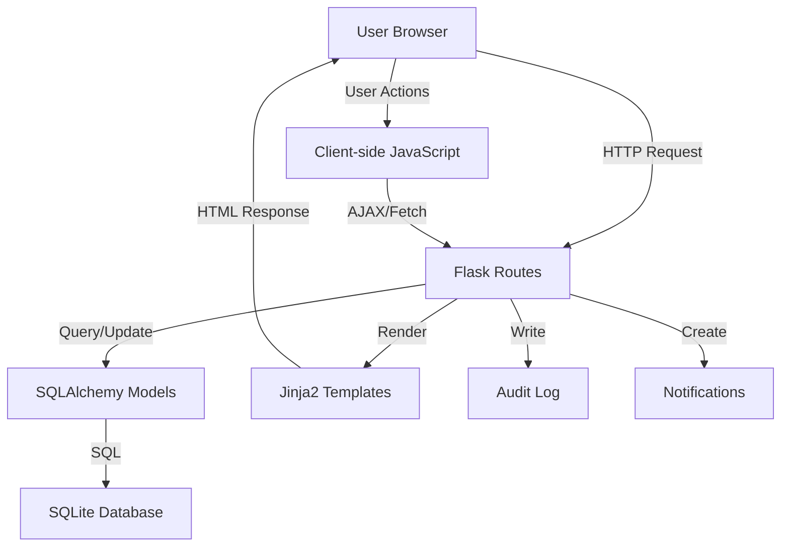

# Design Document: UI/UX Improvements

## Overview

This design document specifies the technical implementation for six UI/UX improvements to the Surveyor.AI application. These enhancements focus on improving user experience through community-driven moderation, preventing accidental actions, providing clearer feedback, and ensuring data quality. The improvements maintain consistency with the existing design system while adding new functionality that aligns with modern web application standards.

The six improvements are:
1. Community False Report Flagging - Enable users to flag inaccurate reports
2. Configurable False Report Threshold - Admin control over auto-flagging sensitivity
3. Logout Confirmation Dialog - Prevent accidental session termination
4. Audit Log Relocation - Move audit logs to analytics page for better organization
5. Specific Login/Registration Error Messages - Field-level error feedback
6. Rename Reset to Clear Filters - Improve button clarity across all pages
7. Required Photo Attachment - Enforce visual evidence for all reports

## Architecture

### System Context

The Surveyor.AI application is a Flask-based web application with SQLAlchemy ORM for database operations. The architecture follows a traditional server-side rendering pattern with progressive enhancement through JavaScript for interactive features.

**Technology Stack:**
- Backend: Flask (Python)
- Database: SQLite with SQLAlchemy ORM
- Frontend: Server-rendered HTML templates (Jinja2) with vanilla JavaScript
- Styling: Custom CSS with CSS variables for theming

### Component Interaction




### Design Principles

1. **Progressive Enhancement**: Core functionality works without JavaScript, enhanced features layer on top
2. **Consistency**: Maintain existing design patterns and visual language
3. **Accessibility**: Ensure all interactive elements are keyboard accessible and screen-reader friendly
4. **Performance**: Minimize database queries and optimize client-side operations
5. **Security**: Validate all inputs on both client and server side

## Components and Interfaces

### 1. Community False Report Flagging System

#### Database Schema Changes

**New Table: `report_flag`**
```sql
CREATE TABLE report_flag (
    id INTEGER PRIMARY KEY AUTOINCREMENT,
    report_id INTEGER NOT NULL,
    user_id INTEGER NOT NULL,
    created_at INTEGER NOT NULL,
    FOREIGN KEY (report_id) REFERENCES report(id) ON DELETE CASCADE,
    FOREIGN KEY (user_id) REFERENCES user(id) ON DELETE CASCADE,
    UNIQUE(report_id, user_id)
);

CREATE INDEX idx_report_flag_report ON report_flag(report_id);
CREATE INDEX idx_report_flag_user ON report_flag(user_id);
```

**SQLAlchemy Model:**
```python
class ReportFlag(db.Model):
    __tablename__ = 'report_flag'
    
    id = db.Column(db.Integer, primary_key=True)
    report_id = db.Column(db.Integer, db.ForeignKey('report.id', ondelete='CASCADE'), nullable=False, index=True)
    user_id = db.Column(db.Integer, db.ForeignKey('user.id', ondelete='CASCADE'), nullable=False, index=True)
    created_at = db.Column(db.Integer, nullable=False, default=lambda: int(time.time()))
    
    __table_args__ = (
        db.UniqueConstraint('report_id', 'user_id', name='unique_report_user_flag'),
    )
```

**New Settings Entry:**
```python
# Default value in Settings table
{
    'key': 'community_false_report_threshold',
    'value': '3'
}
```


#### API Endpoints

**POST /api/reports/<report_id>/flag**
- Purpose: Flag a report as false
- Authentication: Required (any authenticated user)
- Request Body: None (user_id from session)
- Response: JSON with flag count and auto-flag status
- Side Effects: Creates flag record, may trigger auto-flagging, creates notification, writes audit log

```python
@app.route('/api/reports/<int:report_id>/flag', methods=['POST'])
@login_required_view
def flag_report(report_id):
    cu = _get_current_user()
    report = Report.query.get_or_404(report_id)
    
    # Check for existing flag
    existing = ReportFlag.query.filter_by(
        report_id=report_id,
        user_id=cu.id
    ).first()
    
    if existing:
        return jsonify({'error': 'Already flagged'}), 400
    
    # Create flag
    flag = ReportFlag(report_id=report_id, user_id=cu.id)
    db.session.add(flag)
    
    # Count total flags
    flag_count = ReportFlag.query.filter_by(report_id=report_id).count() + 1
    
    # Check threshold
    threshold_setting = Settings.query.filter_by(key='community_false_report_threshold').first()
    threshold = int(threshold_setting.value) if threshold_setting else 3
    
    auto_flagged = False
    if flag_count >= threshold and not report.is_false_report:
        report.is_false_report = True
        auto_flagged = True
        
        # Increment author's false report count
        author = User.query.get(report.user_id)
        if author:
            author.false_reports_count += 1
        
        # Create notification for author
        notif = Notification(
            user_id=report.user_id,
            title='Report Flagged as False',
            message=f'Your report "{report.title}" has been flagged as false by the community.',
            link=f'/my-reports'
        )
        db.session.add(notif)
        
        # Audit log
        write_audit_log(
            action='REPORT_AUTO_FLAGGED_FALSE',
            resource_type='report',
            resource_id=report_id,
            detail={'flag_count': flag_count, 'threshold': threshold}
        )
    
    db.session.commit()
    
    return jsonify({
        'success': True,
        'flag_count': flag_count,
        'auto_flagged': auto_flagged,
        'threshold': threshold
    })
```


#### UI Components

**Flag Button Component (Map View)**
```html
<!-- Added to report popup in map.html -->
<div class="report-actions">
    <button class="reaction-btn" onclick="reactToReport(${r.id}, 'up')">
        👍 <span id="thumbs-up-${r.id}">${r.thumbs_up_count}</span>
    </button>
    <button class="reaction-btn" onclick="reactToReport(${r.id}, 'down')">
        👎 <span id="thumbs-down-${r.id}">${r.thumbs_down_count}</span>
    </button>
    <button class="flag-btn" onclick="flagReport(${r.id})" id="flag-btn-${r.id}">
        🚩 Flag as False
    </button>
</div>
```

**JavaScript Handler:**
```javascript
async function flagReport(reportId) {
    if (!confirm('Flag this report as false? This action cannot be undone.')) {
        return;
    }
    
    try {
        const res = await fetch(`/api/reports/${reportId}/flag`, {
            method: 'POST',
            headers: {'Content-Type': 'application/json'}
        });
        
        const data = await res.json();
        
        if (res.ok) {
            const btn = document.getElementById(`flag-btn-${reportId}`);
            btn.disabled = true;
            btn.textContent = '✓ Flagged';
            btn.classList.add('flagged');
            
            if (data.auto_flagged) {
                alert(`Report has been automatically marked as false (${data.flag_count}/${data.threshold} flags)`);
                // Refresh map to hide the marker
                location.reload();
            } else {
                alert(`Report flagged (${data.flag_count}/${data.threshold})`);
            }
        } else {
            alert(data.error || 'Failed to flag report');
        }
    } catch (e) {
        alert('Network error. Please try again.');
    }
}
```

**CSS Styling:**
```css
.flag-btn {
    background: #fef2f2;
    border: 1px solid #fecaca;
    color: #991b1b;
    padding: 6px 12px;
    border-radius: 6px;
    font-size: 13px;
    font-weight: 600;
    cursor: pointer;
    transition: all 0.2s;
}

.flag-btn:hover {
    background: #fee2e2;
    border-color: #fca5a5;
}

.flag-btn:disabled,
.flag-btn.flagged {
    background: #f1f5f9;
    border-color: #cbd5e1;
    color: #64748b;
    cursor: not-allowed;
}
```


### 2. Configurable False Report Threshold

#### Settings Page Integration

**HTML Form Addition (settings.html):**
```html
<!-- Add to General Configuration section -->
<div class="setting-group">
    <div class="setting-title">Community False Report Threshold</div>
    <div class="setting-desc">
        The number of community flags required to automatically mark a report as false.
        Lower values increase moderation sensitivity.
    </div>
    <div class="setting-input-wrap">
        <input 
            type="number" 
            name="community_false_report_threshold" 
            class="control-input setting-input" 
            min="1" 
            max="10"
            value="{{ settings.community_false_report_threshold }}" 
            required 
        />
        <span class="setting-unit">flags</span>
    </div>
</div>
```

**Backend Handler (app.py):**
```python
@app.route('/settings', methods=['GET', 'POST'])
@require_admin_view
def settings_page():
    if request.method == 'POST':
        _validate_csrf()
        action = request.form.get('action')
        
        if action == 'general_settings':
            # Existing settings...
            
            # New threshold setting
            threshold = request.form.get('community_false_report_threshold', '').strip()
            if threshold:
                try:
                    threshold_val = int(threshold)
                    if threshold_val < 1:
                        errors.append('Community false report threshold must be at least 1')
                    else:
                        setting = Settings.query.filter_by(key='community_false_report_threshold').first()
                        if not setting:
                            setting = Settings(key='community_false_report_threshold')
                            db.session.add(setting)
                        setting.value = str(threshold_val)
                        
                        write_audit_log(
                            action='SETTINGS_CHANGED',
                            detail={'setting': 'community_false_report_threshold', 'value': threshold_val}
                        )
                except ValueError:
                    errors.append('Invalid threshold value')
            
            if not errors:
                db.session.commit()
                return redirect(url_for('settings_page', success=1))
    
    # Load settings for display
    settings_dict = {}
    for s in Settings.query.all():
        settings_dict[s.key] = s.value
    
    # Set defaults
    settings_dict.setdefault('community_false_report_threshold', '3')
    
    return render_template('settings.html', 
                         settings=settings_dict,
                         csrf_token=_get_csrf_token())
```


### 3. Logout Confirmation Dialog

#### Modal Component

**HTML Structure (added to base layout or each page):**
```html
<!-- Logout Confirmation Modal -->
<div id="logoutModal" class="modal" style="display:none;">
    <div class="modal-overlay" onclick="closeLogoutModal()"></div>
    <div class="modal-content">
        <div class="modal-header">
            <h3 class="modal-title">Confirm Logout</h3>
        </div>
        <div class="modal-body">
            <p>Are you sure you want to log out?</p>
        </div>
        <div class="modal-footer">
            <button class="btn secondary" onclick="closeLogoutModal()">Cancel</button>
            <button class="btn primary" onclick="confirmLogout()">Log Out</button>
        </div>
    </div>
</div>
```

**CSS Styling:**
```css
.modal {
    position: fixed;
    top: 0;
    left: 0;
    width: 100%;
    height: 100%;
    z-index: 9999;
    display: flex;
    align-items: center;
    justify-content: center;
}

.modal-overlay {
    position: absolute;
    top: 0;
    left: 0;
    width: 100%;
    height: 100%;
    background: rgba(0, 0, 0, 0.5);
    backdrop-filter: blur(2px);
}

.modal-content {
    position: relative;
    background: white;
    border-radius: 12px;
    box-shadow: 0 20px 25px -5px rgba(0, 0, 0, 0.1), 0 10px 10px -5px rgba(0, 0, 0, 0.04);
    max-width: 400px;
    width: 90%;
    z-index: 10000;
    animation: modalSlideIn 0.2s ease-out;
}

@keyframes modalSlideIn {
    from {
        opacity: 0;
        transform: translateY(-20px);
    }
    to {
        opacity: 1;
        transform: translateY(0);
    }
}

.modal-header {
    padding: 20px 24px 16px;
    border-bottom: 1px solid #e5e7eb;
}

.modal-title {
    margin: 0;
    font-size: 18px;
    font-weight: 700;
    color: #0f172a;
}

.modal-body {
    padding: 20px 24px;
    color: #475569;
    font-size: 15px;
    line-height: 1.6;
}

.modal-footer {
    padding: 16px 24px 20px;
    display: flex;
    gap: 12px;
    justify-content: flex-end;
}

.modal-footer .btn {
    min-width: 100px;
}
```


**JavaScript Handler:**
```javascript
// Intercept logout link clicks
document.addEventListener('DOMContentLoaded', function() {
    const logoutLinks = document.querySelectorAll('a[href="/logout"]');
    
    logoutLinks.forEach(link => {
        link.addEventListener('click', function(e) {
            e.preventDefault();
            showLogoutModal();
        });
    });
});

function showLogoutModal() {
    const modal = document.getElementById('logoutModal');
    if (modal) {
        modal.style.display = 'flex';
    }
}

function closeLogoutModal() {
    const modal = document.getElementById('logoutModal');
    if (modal) {
        modal.style.display = 'none';
    }
}

function confirmLogout() {
    window.location.href = '/logout';
}

// Close modal on Escape key
document.addEventListener('keydown', function(e) {
    if (e.key === 'Escape') {
        closeLogoutModal();
    }
});
```

**Alternative: Inline Confirmation (Simpler Approach)**
```javascript
// For pages where modal is not desired, use browser confirm
document.addEventListener('DOMContentLoaded', function() {
    const logoutLinks = document.querySelectorAll('a[href="/logout"]');
    
    logoutLinks.forEach(link => {
        link.addEventListener('click', function(e) {
            if (!confirm('Are you sure you want to log out?')) {
                e.preventDefault();
            }
        });
    });
});
```

### 4. Audit Log Relocation

#### Template Changes

**Remove from settings.html:**
- Remove entire "Activity & Audit Log" accordion section
- Remove audit log JavaScript functions
- Remove audit log CSS specific to settings page

**Add to analytics.html:**
```html
<!-- Add after existing chart sections -->
<div class="chart-card span-12">
    <div class="chart-header">
        <div class="chart-title">System Activity Log</div>
    </div>
    <div class="chart-desc">
        Chronological record of significant actions performed by administrators and users.
    </div>
    
    <!-- Audit Log Filters -->
    <div class="chart-filters audit-filters">
        <div class="control">
            <label class="control-label">Action Type</label>
            <select id="auditActionFilter" class="control-input" style="width:160px;">
                <option value="">All Actions</option>
            </select>
        </div>
        <div class="control">
            <label class="control-label">Actor</label>
            <input type="text" id="auditActorFilter" class="control-input" 
                   placeholder="Username..." style="width:140px;" />
        </div>
        <div class="control">
            <label class="control-label">Start Date</label>
            <input type="date" id="auditStartDate" class="control-input" style="width:140px;" />
        </div>
        <div class="control">
            <label class="control-label">End Date</label>
            <input type="date" id="auditEndDate" class="control-input" style="width:140px;" />
        </div>
        <div class="control actions" style="display:flex; gap:8px;">
            <button class="btn secondary" onclick="loadAuditLog(1)">Apply</button>
            <button class="btn secondary" onclick="exportAuditLog()">Export</button>
        </div>
    </div>
    
    <!-- Audit Log Table -->
    <div class="chart-body" style="padding:0;">
        <div class="table-wrap">
            <table class="table" id="auditTable">
                <thead>
                    <tr>
                        <th>Timestamp</th>
                        <th>Actor</th>
                        <th>Action</th>
                        <th>Resource</th>
                        <th>Detail</th>
                        <th>IP Address</th>
                    </tr>
                </thead>
                <tbody id="auditTableBody">
                    <tr><td colspan="6" class="empty">Loading...</td></tr>
                </tbody>
            </table>
        </div>
        <div class="audit-pagination" id="auditPagination"></div>
    </div>
</div>
```


**JavaScript Migration:**
```javascript
// Copy existing audit log functions from settings.html to analytics.html
// Functions to migrate:
// - loadAuditLog(page)
// - renderAuditPagination(page, pages, total)
// - exportAuditLog()

// Initialize on page load
document.addEventListener('DOMContentLoaded', function() {
    // Load audit log after other analytics data
    setTimeout(() => loadAuditLog(1), 500);
});
```

**CSS Updates (analytics.css):**
```css
.audit-filters {
    display: grid;
    grid-template-columns: auto auto auto auto auto;
    gap: 12px;
    align-items: flex-end;
    margin-bottom: 16px;
}

.audit-pagination {
    display: flex;
    align-items: center;
    justify-content: space-between;
    padding: 12px 16px;
    border-top: 1px solid #e2e8f0;
}

.audit-badge {
    display: inline-block;
    padding: 4px 8px;
    border-radius: 4px;
    font-size: 11px;
    font-weight: 700;
    text-transform: uppercase;
}

.audit-badge--auth { background: #dbeafe; color: #1e40af; }
.audit-badge--user { background: #fef3c7; color: #92400e; }
.audit-badge--report { background: #fce7f3; color: #831843; }
.audit-badge--defect { background: #e0e7ff; color: #3730a3; }
.audit-badge--settings { background: #f3e8ff; color: #6b21a8; }
.audit-badge--backup { background: #d1fae5; color: #065f46; }

.audit-detail-cell {
    max-width: 300px;
    overflow: hidden;
    text-overflow: ellipsis;
    white-space: nowrap;
}

.audit-detail-kv {
    display: inline-block;
    margin-right: 8px;
}
```


### 5. Specific Login and Registration Error Messages

#### Error Handling Architecture

**Backend Error Structure:**
```python
# Error dictionary format
{
    'field_name': ['error message 1', 'error message 2'],
    'general': ['general error message']
}
```

**Login Route Enhancement:**
```python
@app.route('/login', methods=['GET', 'POST'])
def login():
    if request.method == 'POST':
        username_or_email = request.form.get('username', '').strip()
        password = request.form.get('password', '').strip()
        
        field_errors = {}
        
        if not username_or_email:
            field_errors['username'] = ['Username or email is required']
        
        if not password:
            field_errors['password'] = ['Password is required']
        
        if field_errors:
            return render_template('login.html', 
                                 field_errors=field_errors,
                                 values={'username': username_or_email})
        
        # Try to find user by username or email
        user = User.query.filter(
            or_(
                User.username == username_or_email,
                User.email == username_or_email
            )
        ).first()
        
        if not user:
            field_errors['username'] = ['Username or email not found']
            return render_template('login.html',
                                 field_errors=field_errors,
                                 values={'username': username_or_email})
        
        if not user.check_password(password):
            field_errors['password'] = ['Incorrect password']
            return render_template('login.html',
                                 field_errors=field_errors,
                                 values={'username': username_or_email})
        
        # Check account status
        if user.status != 'active':
            field_errors['general'] = [f'Account is {user.status}. Please contact support.']
            return render_template('login.html',
                                 field_errors=field_errors,
                                 values={'username': username_or_email})
        
        # Success - log in user
        session['user_id'] = user.id
        write_audit_log(action='USER_LOGIN')
        
        next_url = request.args.get('next')
        if next_url:
            return redirect(next_url)
        
        return redirect(url_for('index' if user.role == 'admin' else 'map_page'))
    
    return render_template('login.html')
```


**Registration Route Enhancement:**
```python
@app.route('/register', methods=['GET', 'POST'])
def register():
    if request.method == 'POST':
        username = request.form.get('username', '').strip()
        email = request.form.get('email', '').strip()
        password = request.form.get('password', '').strip()
        confirm_password = request.form.get('confirm_password', '').strip()
        
        field_errors = {}
        
        # Username validation
        if not username:
            field_errors.setdefault('username', []).append('Username is required')
        elif len(username) < 3:
            field_errors.setdefault('username', []).append('Username must be at least 3 characters')
        elif User.query.filter_by(username=username).first():
            field_errors.setdefault('username', []).append('Username already exists')
        
        # Email validation
        if not email:
            field_errors.setdefault('email', []).append('Email is required')
        elif not re.match(r'^[a-zA-Z0-9._%+-]+@[a-zA-Z0-9.-]+\.[a-zA-Z]{2,}$', email):
            field_errors.setdefault('email', []).append('Invalid email format')
        elif User.query.filter_by(email=email).first():
            field_errors.setdefault('email', []).append('Email already registered')
        
        # Password validation
        if not password:
            field_errors.setdefault('password', []).append('Password is required')
        else:
            if len(password) < 8:
                field_errors.setdefault('password', []).append('Password must be at least 8 characters')
            if not re.search(r'[A-Z]', password):
                field_errors.setdefault('password', []).append('Password must contain at least one uppercase letter')
            if not re.search(r'[a-z]', password):
                field_errors.setdefault('password', []).append('Password must contain at least one lowercase letter')
            if not re.search(r'[0-9]', password):
                field_errors.setdefault('password', []).append('Password must contain at least one number')
        
        # Confirm password validation
        if password and confirm_password and password != confirm_password:
            field_errors.setdefault('confirm_password', []).append('Passwords do not match')
        
        if field_errors:
            return render_template('register.html',
                                 field_errors=field_errors,
                                 values={
                                     'username': username,
                                     'email': email
                                 })
        
        # Create user
        user = User(username=username, email=email, role='user', status='active')
        user.set_password(password)
        db.session.add(user)
        db.session.commit()
        
        write_audit_log(action='USER_REGISTERED', resource_type='user', resource_id=user.id)
        
        # Auto-login
        session['user_id'] = user.id
        
        return redirect(url_for('map_page'))
    
    return render_template('register.html')
```


**Template Updates (login.html):**
```html
<form method="post" action="{{ url_for('login') }}">
    <div class="field">
        <label for="username">Username or Email</label>
        <input 
            type="text" 
            id="username" 
            name="username" 
            class="input input-error"
            value="{{ values.username if values else '' }}"
            autocomplete="username"
        />
        
        <div class="field-error">
            
            <div class="error-message">{{ error }}</div>
            
        </div>
        
    </div>
    
    <div class="field">
        <label for="password">Password</label>
        <input 
            type="password" 
            id="password" 
            name="password" 
            class="input input-error"
            autocomplete="current-password"
        />
        
        <div class="field-error">
            
            <div class="error-message">{{ error }}</div>
            
        </div>
        
    </div>
    
    
    <div class="general-error">
        
        <div class="error-message">{{ error }}</div>
        
    </div>
    
    
    <div class="actions">
        <button type="submit" class="btn">Log In</button>
    </div>
</form>
```

**CSS for Error States:**
```css
.input-error {
    border-color: #ef4444 !important;
    background: #fef2f2;
}

.input-error:focus {
    box-shadow: 0 0 0 3px rgba(239, 68, 68, 0.15) !important;
}

.field-error {
    margin-top: 6px;
}

.error-message {
    font-size: 13px;
    color: #dc2626;
    font-weight: 600;
    line-height: 1.4;
    margin-top: 4px;
}

.general-error {
    margin-bottom: 16px;
    padding: 12px;
    background: #fef2f2;
    border: 1px solid #fecaca;
    border-radius: 8px;
}

.general-error .error-message {
    color: #991b1b;
    font-size: 14px;
}
```


**Client-side Error Clearing:**
```javascript
// Clear field errors when user starts typing
document.addEventListener('DOMContentLoaded', function() {
    const inputs = document.querySelectorAll('.input-error');
    
    inputs.forEach(input => {
        input.addEventListener('input', function() {
            // Remove error class
            this.classList.remove('input-error');
            
            // Remove error message
            const field = this.closest('.field');
            if (field) {
                const errorDiv = field.querySelector('.field-error');
                if (errorDiv) {
                    errorDiv.remove();
                }
            }
        });
    });
});
```

### 6. Rename Reset to Clear Filters

#### Template Changes

**Files to Update:**
- `templates/users.html`
- `templates/defects.html`
- `templates/my_reports.html`
- `templates/map.html`

**Change Pattern:**
```html
<!-- Before -->
<button class="btn secondary" onclick="resetFilters()">Reset</button>

<!-- After -->
<button class="btn secondary" onclick="resetFilters()">Clear Filters</button>
```

**Example from users.html:**
```html
<div class="control actions">
    <button class="btn secondary" onclick="applyFilters()">Apply</button>
    <button class="btn secondary" onclick="resetFilters()">Clear Filters</button>
</div>
```

**No JavaScript changes required** - the `resetFilters()` function name remains the same, only the button text changes.

**Responsive Considerations:**
```css
/* Ensure button text remains visible on mobile */
@media (max-width: 768px) {
    .control.actions .btn {
        min-width: 120px;
        white-space: nowrap;
    }
}
```


### 7. Required Photo Attachment

#### Form Validation Changes

**Template Update (reports.html):**
```html
<!-- Update photo upload field -->
<div class="control full-width">
    <label class="control-label">Evidence Photo</label>
    <label class="upload-box" id="uploadBox" for="photo">
        <input 
            id="photo" 
            type="file" 
            name="photo" 
            accept="image/png,image/jpeg" 
            required
            style="display:none;" 
        />
        <div id="uploadPlaceholder">
            <div class="upload-icon">📷</div>
            <div class="upload-text">Click to upload photo (required)</div>
            <div style="font-size:11px; color:#94a3b8; margin-top:4px;">JPG or PNG</div>
        </div>
        
    </label>
    <div id="photoError" class="field-error" style="display:none;">
        <div class="error-message">Photo is required</div>
    </div>
</div>
```

**Client-side Validation:**
```javascript
// Enhanced form validation
if (form) {
    form.addEventListener('submit', (e) => {
        showClientError('');
        
        // Existing validations...
        
        // Photo validation
        const photoInput = document.getElementById('photo');
        const photoError = document.getElementById('photoError');
        
        if (!photoInput.files || photoInput.files.length === 0) {
            e.preventDefault();
            if (photoError) {
                photoError.style.display = 'block';
            }
            showClientError('Photo is required. Please upload an image.');
            return;
        }
        
        // Validate file type
        const file = photoInput.files[0];
        const validTypes = ['image/jpeg', 'image/jpg', 'image/png'];
        if (!validTypes.includes(file.type)) {
            e.preventDefault();
            if (photoError) {
                photoError.style.display = 'block';
                photoError.querySelector('.error-message').textContent = 
                    'Invalid file type. Please upload JPG or PNG.';
            }
            showClientError('Invalid file type. Please upload JPG or PNG.');
            return;
        }
        
        // Validate file size (max 5MB)
        const maxSize = 5 * 1024 * 1024; // 5MB
        if (file.size > maxSize) {
            e.preventDefault();
            if (photoError) {
                photoError.style.display = 'block';
                photoError.querySelector('.error-message').textContent = 
                    'File too large. Maximum size is 5MB.';
            }
            showClientError('File too large. Maximum size is 5MB.');
            return;
        }
    });
    
    // Clear error when file is selected
    const photoInput = document.getElementById('photo');
    if (photoInput) {
        photoInput.addEventListener('change', function() {
            const photoError = document.getElementById('photoError');
            if (photoError) {
                photoError.style.display = 'none';
            }
        });
    }
}
```


**Server-side Validation:**
```python
@app.route('/reports', methods=['GET', 'POST'])
@login_required_view
def reports_page():
    if request.method == 'POST':
        _validate_csrf()
        
        errors = []
        values = {}
        
        # Existing field validations...
        
        # Photo validation
        photo = request.files.get('photo')
        if not photo or photo.filename == '':
            errors.append('Photo is required')
        else:
            # Validate file extension
            filename = secure_filename(photo.filename)
            ext = filename.rsplit('.', 1)[1].lower() if '.' in filename else ''
            
            if ext not in ALLOWED_REPORT_IMAGE_EXTS:
                errors.append('Invalid file type. Only JPG and PNG are allowed.')
            
            # Validate file size (max 5MB)
            photo.seek(0, os.SEEK_END)
            file_size = photo.tell()
            photo.seek(0)
            
            if file_size > 5 * 1024 * 1024:
                errors.append('File too large. Maximum size is 5MB.')
        
        if errors:
            return render_template('reports.html',
                                 errors=errors,
                                 values=values,
                                 csrf_token=_get_csrf_token(),
                                 is_admin=_is_admin(_get_current_user()))
        
        # Save photo
        photo_filename = f"{uuid4().hex}.{ext}"
        photo_path = os.path.join(UPLOAD_FOLDER, photo_filename)
        os.makedirs(UPLOAD_FOLDER, exist_ok=True)
        photo.save(photo_path)
        
        # Create report with photo
        report = Report(
            user_id=cu.id,
            title=title,
            body=body,
            latitude=latitude,
            longitude=longitude,
            obstruction_type=obstruction_type,
            photo_path=f"uploads/reports/{photo_filename}"
        )
        db.session.add(report)
        db.session.commit()
        
        write_audit_log(
            action='REPORT_SUBMITTED',
            resource_type='report',
            resource_id=report.id,
            detail={'type': obstruction_type, 'has_photo': True}
        )
        
        return render_template('reports.html',
                             success=True,
                             csrf_token=_get_csrf_token(),
                             is_admin=_is_admin(cu))
    
    return render_template('reports.html',
                         csrf_token=_get_csrf_token(),
                         is_admin=_is_admin(_get_current_user()))
```


## Data Models

### New Models

**ReportFlag Model:**
```python
class ReportFlag(db.Model):
    """
    Tracks community flags on reports for false report detection.
    Enforces one flag per user per report through unique constraint.
    """
    __tablename__ = 'report_flag'
    
    id = db.Column(db.Integer, primary_key=True)
    report_id = db.Column(db.Integer, db.ForeignKey('report.id', ondelete='CASCADE'), 
                         nullable=False, index=True)
    user_id = db.Column(db.Integer, db.ForeignKey('user.id', ondelete='CASCADE'), 
                       nullable=False, index=True)
    created_at = db.Column(db.Integer, nullable=False, default=lambda: int(time.time()))
    
    __table_args__ = (
        db.UniqueConstraint('report_id', 'user_id', name='unique_report_user_flag'),
    )
```

### Modified Models

**Settings Model (existing, new entry):**
- Key: `community_false_report_threshold`
- Value: String representation of integer (default: "3")
- Purpose: Controls how many flags trigger auto-flagging

### Database Migrations

**Migration Script:**
```python
# Add to app.py initialization block
with app.app_context():
    # Create report_flag table
    try:
        db.session.execute(text("SELECT 1 FROM report_flag LIMIT 1"))
    except Exception:
        db.session.rollback()
        db.session.execute(text(
            "CREATE TABLE IF NOT EXISTS report_flag ("
            "id INTEGER PRIMARY KEY AUTOINCREMENT, "
            "report_id INTEGER NOT NULL, "
            "user_id INTEGER NOT NULL, "
            "created_at INTEGER NOT NULL, "
            "FOREIGN KEY (report_id) REFERENCES report(id) ON DELETE CASCADE, "
            "FOREIGN KEY (user_id) REFERENCES user(id) ON DELETE CASCADE, "
            "UNIQUE(report_id, user_id)"
            ")"
        ))
        db.session.execute(text("CREATE INDEX IF NOT EXISTS idx_report_flag_report ON report_flag(report_id)"))
        db.session.execute(text("CREATE INDEX IF NOT EXISTS idx_report_flag_user ON report_flag(user_id)"))
        db.session.commit()
    
    # Add default threshold setting
    threshold_setting = Settings.query.filter_by(key='community_false_report_threshold').first()
    if not threshold_setting:
        db.session.add(Settings(key='community_false_report_threshold', value='3'))
        db.session.commit()
```


## Correctness Properties

*A property is a characteristic or behavior that should hold true across all valid executions of a system—essentially, a formal statement about what the system should do. Properties serve as the bridge between human-readable specifications and machine-verifiable correctness guarantees.*

### Property 1: Flag Record Creation

*For any* authenticated user and any report, when the user flags the report, the system should create a ReportFlag record with the correct user_id, report_id, and timestamp.

**Validates: Requirements 1.2**

### Property 2: Auto-flagging Threshold Enforcement

*For any* report with a flag count greater than or equal to the configured threshold, the report should be marked as is_false_report=True.

**Validates: Requirements 1.3**

### Property 3: Author False Report Count Increment

*For any* report that gets auto-flagged as false, the report author's false_reports_count should increase by exactly 1.

**Validates: Requirements 1.4**

### Property 4: Auto-flag Notification Creation

*For any* report that gets auto-flagged as false, a notification should be created for the report author with the correct title and message.

**Validates: Requirements 1.5**

### Property 5: Duplicate Flag Prevention

*For any* user-report pair, attempting to create a second flag should fail with a unique constraint violation.

**Validates: Requirements 1.6**

### Property 6: False Report Map Filtering

*For any* report where is_false_report=True, the report should not appear in map view query results.

**Validates: Requirements 1.7**

### Property 7: Flag Action Audit Logging

*For any* flag action or auto-flag event, an audit log entry should exist with action='REPORT_FLAGGED_FALSE' or action='REPORT_AUTO_FLAGGED_FALSE'.

**Validates: Requirements 1.8**

### Property 8: Threshold Validation

*For any* threshold value less than 1, the settings update should be rejected with a validation error.

**Validates: Requirements 2.3**

### Property 9: Threshold Update Persistence

*For any* valid threshold update by an admin, both the Settings table and AuditLog table should contain corresponding records.

**Validates: Requirements 2.4**

### Property 10: Audit Log API Functionality

*For any* valid audit log API request with filters, the response should contain only entries matching all specified filter criteria.

**Validates: Requirements 4.3**


### Property 11: Email Format Validation

*For any* email string that does not match the pattern `^[a-zA-Z0-9._%+-]+@[a-zA-Z0-9.-]+\.[a-zA-Z]{2,}$`, the registration should be rejected with "Invalid email format" error.

**Validates: Requirements 5.5**

### Property 12: Password Requirement Validation

*For any* password that fails a specific requirement (length, uppercase, lowercase, or digit), the registration should display the specific requirement that was not met.

**Validates: Requirements 5.6**

### Property 13: Error Clearing on Input

*For any* input field with a displayed error, modifying the field value should remove the error-related CSS classes and error message elements.

**Validates: Requirements 5.7**

### Property 14: Photo Submission Validation

*For any* report submission without a photo file, the system should reject the submission with "Photo is required" error.

**Validates: Requirements 7.2**

### Property 15: Server-side Photo Validation

*For any* server-side report submission request without a photo file, the response should contain an error and the report should not be created.

**Validates: Requirements 7.4**

### Property 16: File Type Validation

*For any* uploaded file with an extension other than jpg, jpeg, or png, the system should reject the submission with a file type error.

**Validates: Requirements 7.5**

## Error Handling

### Client-side Error Handling

**Validation Errors:**
- Display inline field errors immediately below the relevant input
- Use red color scheme (#ef4444 border, #fef2f2 background)
- Clear errors when user modifies the field
- Prevent form submission until all errors are resolved

**Network Errors:**
- Display user-friendly messages for failed API calls
- Provide retry mechanisms for transient failures
- Log errors to console for debugging

**Example:**
```javascript
try {
    const res = await fetch('/api/reports/123/flag', {method: 'POST'});
    if (!res.ok) {
        const data = await res.json();
        alert(data.error || 'An error occurred');
    }
} catch (e) {
    console.error('Network error:', e);
    alert('Network error. Please check your connection and try again.');
}
```


### Server-side Error Handling

**Database Errors:**
- Catch IntegrityError for unique constraint violations (duplicate flags)
- Rollback transactions on error
- Return appropriate HTTP status codes (400 for validation, 409 for conflicts, 500 for server errors)

**Validation Errors:**
- Validate all inputs before database operations
- Return structured error responses with field-specific messages
- Log validation failures for security monitoring

**Example:**
```python
try:
    flag = ReportFlag(report_id=report_id, user_id=cu.id)
    db.session.add(flag)
    db.session.commit()
except IntegrityError:
    db.session.rollback()
    return jsonify({'error': 'Already flagged'}), 409
except Exception as e:
    db.session.rollback()
    app.logger.error(f'Flag creation failed: {e}')
    return jsonify({'error': 'Server error'}), 500
```

**Authentication Errors:**
- Return 401 for unauthenticated requests
- Return 403 for unauthorized actions (non-admin accessing admin features)
- Redirect to login page for web requests

**File Upload Errors:**
- Validate file size before processing
- Validate file type by extension and MIME type
- Handle missing files gracefully
- Clean up temporary files on error

### Error Recovery

**Transaction Rollback:**
- All database operations wrapped in try-except blocks
- Automatic rollback on any exception
- Preserve data consistency

**User Feedback:**
- Clear error messages explaining what went wrong
- Actionable guidance on how to fix the issue
- Preserve user input on validation errors (except passwords)

**Logging:**
- Log all errors with context (user_id, request path, timestamp)
- Use appropriate log levels (ERROR for failures, WARNING for validation issues)
- Include stack traces for debugging


## Testing Strategy

### Dual Testing Approach

This feature requires both unit tests and property-based tests to ensure comprehensive coverage:

**Unit Tests:**
- Specific examples of flag creation, threshold enforcement, and error handling
- UI component rendering and interaction
- Edge cases like boundary threshold values
- Integration between components

**Property-Based Tests:**
- Universal properties that hold across all inputs
- Randomized test data generation for robust validation
- Comprehensive input coverage through iteration

Together, unit tests catch concrete bugs while property tests verify general correctness across the input space.

### Property-Based Testing Configuration

**Framework:** Hypothesis (Python)
- Install: `pip install hypothesis`
- Minimum 100 iterations per property test
- Each test tagged with feature name and property number

**Example Property Test:**
```python
from hypothesis import given, strategies as st
import pytest

@given(
    flag_count=st.integers(min_value=1, max_value=10),
    threshold=st.integers(min_value=1, max_value=10)
)
def test_auto_flagging_threshold_enforcement(flag_count, threshold):
    """
    Feature: ui-ux-improvements, Property 2: Auto-flagging Threshold Enforcement
    
    For any report with a flag count >= threshold, the report should be marked as false.
    """
    # Setup: Create report and flags
    report = create_test_report()
    for _ in range(flag_count):
        create_test_flag(report.id)
    
    # Set threshold
    set_threshold(threshold)
    
    # Trigger evaluation
    evaluate_report_flags(report.id)
    
    # Assert
    report = Report.query.get(report.id)
    if flag_count >= threshold:
        assert report.is_false_report == True
    else:
        assert report.is_false_report == False
```

### Unit Testing Strategy

**Test Organization:**
```
tests/
├── test_flag_system.py          # Flag creation, duplicate prevention
├── test_threshold_config.py     # Settings management
├── test_logout_confirmation.py  # UI modal behavior
├── test_audit_relocation.py     # API endpoint functionality
├── test_error_messages.py       # Login/registration validation
├── test_filter_buttons.py       # Button text verification
└── test_photo_requirement.py    # Photo validation
```


**Unit Test Examples:**

```python
# Test duplicate flag prevention
def test_duplicate_flag_prevention():
    """Validates: Requirements 1.6"""
    user = create_test_user()
    report = create_test_report()
    
    # First flag succeeds
    flag1 = ReportFlag(report_id=report.id, user_id=user.id)
    db.session.add(flag1)
    db.session.commit()
    
    # Second flag fails
    flag2 = ReportFlag(report_id=report.id, user_id=user.id)
    db.session.add(flag2)
    
    with pytest.raises(IntegrityError):
        db.session.commit()

# Test notification creation
def test_auto_flag_notification():
    """Validates: Requirements 1.5"""
    author = create_test_user(username='author')
    report = create_test_report(user_id=author.id)
    
    # Create flags to trigger auto-flagging
    for i in range(3):
        user = create_test_user(username=f'flagger{i}')
        flag_report(report.id, user.id)
    
    # Check notification was created
    notif = Notification.query.filter_by(user_id=author.id).first()
    assert notif is not None
    assert 'flagged as false' in notif.message.lower()

# Test threshold validation
def test_threshold_validation():
    """Validates: Requirements 2.3"""
    # Valid threshold
    result = update_threshold(5)
    assert result['success'] == True
    
    # Invalid threshold (0)
    result = update_threshold(0)
    assert 'error' in result
    
    # Invalid threshold (negative)
    result = update_threshold(-1)
    assert 'error' in result

# Test email validation
def test_email_format_validation():
    """Validates: Requirements 5.5"""
    invalid_emails = [
        'notanemail',
        '@example.com',
        'user@',
        'user@domain',
        'user domain@example.com'
    ]
    
    for email in invalid_emails:
        result = register_user(email=email, username='test', password='Test123!')
        assert 'Invalid email format' in result['errors']['email']

# Test photo requirement
def test_photo_required():
    """Validates: Requirements 7.2"""
    user = create_test_user()
    
    # Submit without photo
    response = submit_report(
        user_id=user.id,
        latitude=14.5,
        longitude=121.0,
        obstruction_type='Pothole',
        photo=None
    )
    
    assert response.status_code == 400
    assert 'Photo is required' in response.json['errors']
```


### Integration Testing

**API Endpoint Tests:**
- Test flag creation endpoint with valid and invalid inputs
- Test threshold configuration endpoint with admin and non-admin users
- Test audit log API with various filter combinations
- Test report submission with and without photos

**UI Interaction Tests:**
- Use Selenium or Playwright for browser automation
- Test logout confirmation modal flow
- Test error message display and clearing
- Test photo upload preview functionality

**Example Integration Test:**
```python
def test_flag_report_integration(client, auth):
    """Integration test for complete flag workflow"""
    # Login as user1
    auth.login('user1', 'password')
    
    # Create a report
    report_id = create_test_report()
    
    # Flag the report
    response = client.post(f'/api/reports/{report_id}/flag')
    assert response.status_code == 200
    data = response.json
    assert data['flag_count'] == 1
    assert data['auto_flagged'] == False
    
    # Login as user2 and flag again
    auth.logout()
    auth.login('user2', 'password')
    response = client.post(f'/api/reports/{report_id}/flag')
    assert data['flag_count'] == 2
    
    # Login as user3 and flag (should trigger auto-flag)
    auth.logout()
    auth.login('user3', 'password')
    response = client.post(f'/api/reports/{report_id}/flag')
    data = response.json
    assert data['flag_count'] == 3
    assert data['auto_flagged'] == True
    
    # Verify report is marked as false
    report = Report.query.get(report_id)
    assert report.is_false_report == True
    
    # Verify notification was created
    author_id = report.user_id
    notif = Notification.query.filter_by(user_id=author_id).first()
    assert notif is not None
```

### Manual Testing Checklist

**Community Flagging:**
- [ ] Flag button appears on report popups
- [ ] Clicking flag creates database record
- [ ] Duplicate flags are prevented
- [ ] Auto-flagging occurs at threshold
- [ ] Notification is sent to author
- [ ] False reports hidden from map
- [ ] Audit log entries created

**Threshold Configuration:**
- [ ] Setting appears in admin settings page
- [ ] Default value is 3
- [ ] Values < 1 are rejected
- [ ] Changes are saved to database
- [ ] Audit log entry created on change

**Logout Confirmation:**
- [ ] Modal appears on logout click
- [ ] Cancel button closes modal
- [ ] Log Out button proceeds with logout
- [ ] Works on all pages (admin and user)
- [ ] Escape key closes modal

**Audit Log Relocation:**
- [ ] Audit log removed from settings page
- [ ] Audit log appears on analytics page
- [ ] All filters work correctly
- [ ] Pagination works correctly
- [ ] Export functionality works
- [ ] Styling matches analytics page

**Error Messages:**
- [ ] Login shows field-specific errors
- [ ] Registration shows field-specific errors
- [ ] Errors clear when typing
- [ ] Multiple password errors shown
- [ ] Email format validated correctly

**Filter Button Rename:**
- [ ] "Clear Filters" on users page
- [ ] "Clear Filters" on defects page
- [ ] "Clear Filters" on my reports page
- [ ] "Clear Filters" on map page
- [ ] Button functionality unchanged

**Photo Requirement:**
- [ ] Photo field marked as required
- [ ] Client-side validation prevents submission
- [ ] Server-side validation rejects missing photo
- [ ] File type validation works
- [ ] Photo preview displays correctly
- [ ] Label updated to remove "(Optional)"

### Performance Testing

**Database Query Optimization:**
- Index on report_flag(report_id) for fast flag counting
- Index on report_flag(user_id) for duplicate checking
- Efficient query for map filtering (exclude is_false_report=True)

**Load Testing:**
- Test flag endpoint with concurrent requests
- Verify threshold evaluation doesn't cause race conditions
- Test audit log API with large datasets (10,000+ entries)

**Expected Performance:**
- Flag creation: < 100ms
- Threshold evaluation: < 200ms
- Audit log query: < 500ms for 1000 entries
- Photo upload: < 2s for 5MB file

